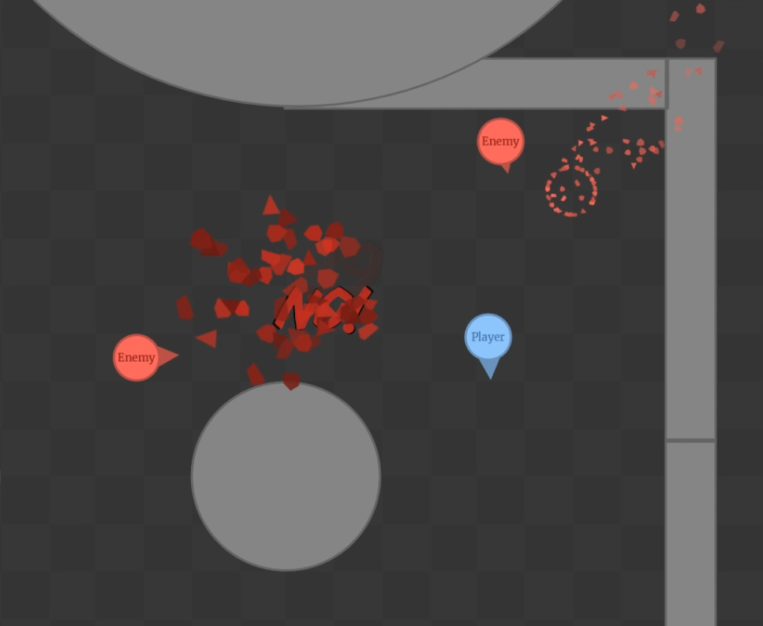

# Game Jam Entry: "Enemies"

Experimenting with top-down character and camera controls, game mechanics and player feedback.

## Running it

Your viewport will be bigger or smaller depending on your screen resolution - a bigger screen is an advantage, but not a requirement.

### The Dev Way

- Clone or download the repository.
- Run `DualityEditor.exe`, let it grab some binaries it needs.
- Close it and run `DualityLauncher.exe`

### The Shortcut

- Download the [binary package](https://github.com/ilexp/bmj2017-01/raw/master/Enemies.zip)
- Extract and run `DualityLauncher.exe`

## Screenshots

_Click on it for bigger (and moving) version._
